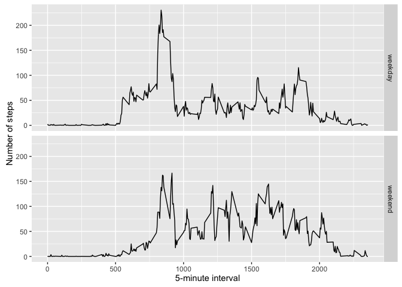

# Reproducible Research: Peer Assessment 1
Igor Escobar  

### Loading and preprocessing the data


```r
# First load libraries
library(knitr)
library(dplyr)
```

```
## 
## Attaching package: 'dplyr'
## 
## The following objects are masked from 'package:stats':
## 
##     filter, lag
## 
## The following objects are masked from 'package:base':
## 
##     intersect, setdiff, setequal, union
```

```r
library(ggplot2)
```

```
## Warning: package 'ggplot2' was built under R version 3.2.3
```


```r
# And now load the data
echo = TRUE  # Always make code visible
filename <- 'activity.csv'
if (!file.exists(filename)) {unzip("activity.zip")}
activityData <- read.csv("activity.csv", colClass=c('integer', 'Date', 'integer'))
```


### Q1. What is mean total number of steps taken per day?


```r
# Calculate the total number of steps taken per day.
totalStepsPerDate <- aggregate(steps ~ date, activityData, sum)
```


```r
# Make a histogram of the total number of steps taken each day.
ggplot(totalStepsPerDate, aes(x = steps)) +
  geom_histogram(fill = 'red', binwidth = 1000) +
  labs(title = 'Histogram: Total steps per day', 
       x = 'Steps per day', 
       y = 'Frequency')
```

 

> Calculate and report the mean and median of the total number of steps taken per day.

The mean is:

```r
mean(totalStepsPerDate$steps, na.rm = TRUE)
```

```
## [1] 10766.19
```
And the median is:

```r
median(totalStepsPerDate$steps, na.rm = TRUE)
```

```
## [1] 10765
```

### Q2. What is the average daily activity pattern?
> Make a time series plot (i.e. 𝚝𝚢𝚙𝚎 = "𝚕") of the 5-minute interval (x-axis) and
  the average number of steps taken, averaged across all days (y-axis)


```r
stepsPerInterval <- aggregate(steps ~ interval, activityData, mean)
ggplot(stepsPerInterval, aes(x=interval, y=steps)) +
  geom_line(color = 'red')
```

 

> Which 5-minute interval, on average across all the days in the dataset, 
  contains the maximum number of steps?
  

```r
stepsPerInterval$interval[which.max(stepsPerInterval$steps)]
```

```
## [1] 835
```


### Q3. Imputing missing values
> Calculate and report the total number of missing values in the dataset (i.e. the total 
  number of rows with NAs)
  

```r
sum(is.na(activityData$steps))
```

```
## [1] 2304
```

> Devise a strategy for filling in all of the missing values in the dataset. The strategy 
  does not need to be sophisticated. For example, you could use the mean/median for that day, 
  or the mean for that 5-minute interval, etc.
  

```r
filledData <- activityData
nasIndex <- is.na(filledData$steps)
meanInterval <- tapply(filledData$steps, filledData$interval, mean, na.rm=TRUE, simplify=TRUE)
```

> Create a new dataset that is equal to the original dataset but with the missing data filled in.


```r
filledData$steps[nasIndex] <- meanInterval[as.character(filledData$interval[nasIndex])]
```

> Make a histogram of the total number of steps taken each day and Calculate and report the mean   and median total number of steps taken per day. Do these values differ from the estimates from   the first part of the assignment? What is the impact of imputing missing data on the estimates   of the total daily number of steps?


```r
totalSteps <- tapply(filledData$steps, filledData$date, FUN=sum)
qplot(totalSteps, binwidth=1000, xlab="total number of steps taken each day")
```

 

```r
mean(totalSteps)
```

```
## [1] 10766.19
```

```r
median(totalSteps)
```

```
## [1] 10766.19
```


### Q4. Are there differences in activity patterns between weekdays and weekends?

```r
weekday.or.weekend <- function(date) {
    day <- weekdays(date)
    if (day %in% c("Monday", "Tuesday", "Wednesday", "Thursday", "Friday"))
        return("weekday")
    else if (day %in% c("Saturday", "Sunday"))
        return("weekend")
    else
        stop("invalid date")
}
filledData$date <- as.Date(filledData$date)
filledData$day <- sapply(filledData$date, FUN=weekday.or.weekend)
```

> Plot of average number of steps taken on weekdays and weekends.


```r
averageSteps <- aggregate(steps ~ interval + day, data=filledData, mean)
ggplot(averageSteps, aes(interval, steps)) + geom_line() + facet_grid(day ~ .) +
    xlab("5-minute interval") + ylab("Number of steps")
```

 

